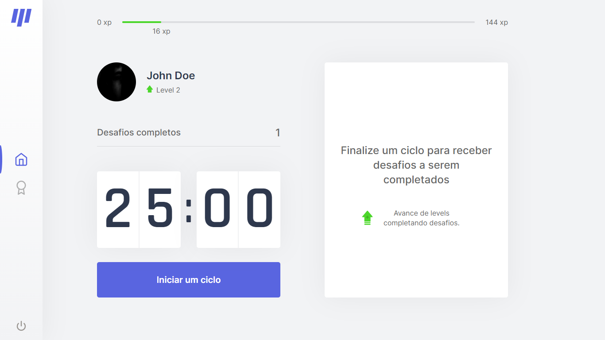
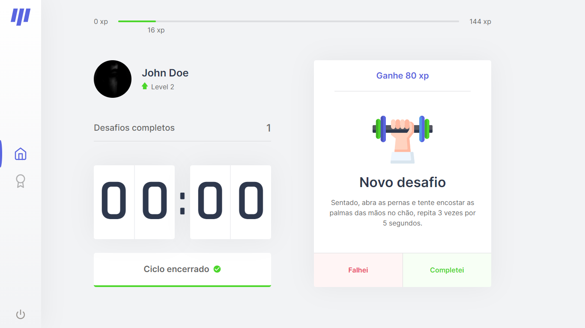

<h1 align="center">Move.it</h1>

<h2 align="center">
  <a href="#-projeto">Projeto</a>&nbsp;&nbsp;&nbsp;|&nbsp;&nbsp;&nbsp;
  <a href="#-tecnologias">Tecnologias</a>&nbsp;&nbsp;&nbsp;|&nbsp;&nbsp;&nbsp;
</h2>

  
  

## 🖥 Projeto

Move.it é uma aplicação desenvolvida durante a trilha de React.js na NLW4. O Move.it mescla a técnia de Pomodoro com exercicios dedicados a pessoas que trabalham em frente a um PC. O intuito é o usuário focar no trabalho por 25 minutos e então fazer alguma atividade física. Para incentivar o uso, o Move.it faz uso da gamificação, através do sistema de levels e experiência, além de uma leaderboard mostrando os usuários com niveis mais altos.

## ⚙ Tecnologias

O presente projeto foi desenvolvido com o uso das seguintes tecnologias:

- [Next.js](https://nextjs.org/)
- [Node.js](https://nodejs.org/en/)
- [TypeORM](https://typeorm.io/#/)
- [TypeScript](https://www.typescriptlang.org/)
